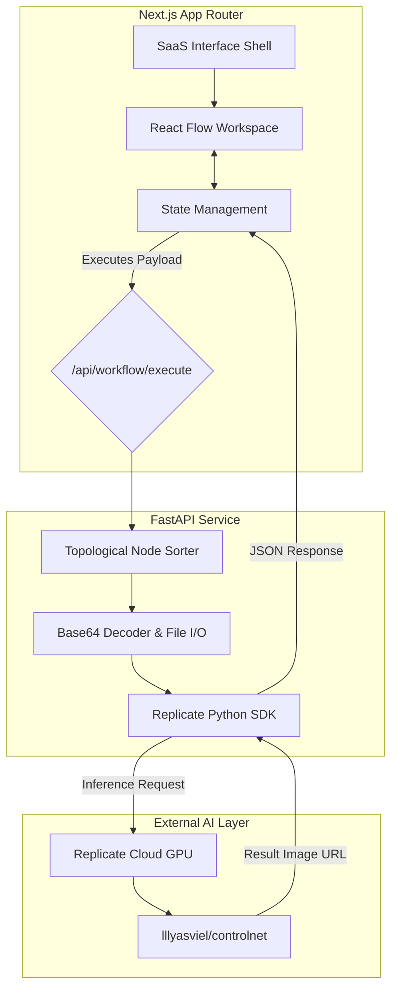

# Realhistic 🎬

A sophisticated, zero-to-one, node-based web application orchestrating generative AI media workflows. Realhistic allows creators to visually design and execute highly complex AI pipelines (like Stable Diffusion / ControlNet) directly in a beautiful drag-and-drop canvas.


---

## 🏗️ System Architecture

Realhistic operates on a decoupled client-server architecture to handle the intensive requirements of Directed Acyclic Graph (DAG) state management and AI inference processing.



### Core Technologies

#### Frontend Client
- **Framework:** Next.js 15 (App Router) + React 19
- **Styling:** TailwindCSS v4 (Minimalist `#0f0f11` Pro-SaaS Aesthetic)
- **State Management:** Zustand (Handling complex DAG edge/node matrix)
- **Canvas Interface:** `@xyflow/react` (React Flow)
- **Icons:** `lucide-react`

#### Processing Backend
- **Framework:** Python 3.11+ via FastAPI
- **Server:** Uvicorn (Asynchronous ASGI)
- **AI Integration:** Replicate Python SDK
- **Data Validation:** Pydantic

---

## ⚡ Key Features

- **Interactive Visual Canvas:** Drag, drop, and link AI procedural steps elegantly.
- **Topological Sorting:** The Python backend correctly maps out edge-dependencies to ensure AI nodes execute in the exact order demanded by the user graph.
- **Robust Media Uploads:** Immersive File API parsing converts local device photos to Base64 byte-streams directly inside the Canvas Nodes.
- **Graceful Fault Tolerance:** Built-in SDK handling for rapid testing. If Replicate tokens are missing/dummy, the system automatically swallows authentication failures, simulates processing times securely, and returns placeholder responses rather than breaking.

---

## 🚀 Quick Start

Ensure you have `Node.js` and `Python 3.11+` installed on your machine.

### 1. Start the Frontend
From the root repository directory:
```bash
npm install
npm run dev
```
The client will fire up on `http://localhost:3000`.

### 2. Configure the Backend
Navigate to the `backend/` directory in a secondary terminal:
```bash
cd backend
python -m venv .venv

# Windows
.\.venv\Scripts\activate
# Mac/Linux
source .venv/bin/activate

pip install -r requirements.txt
```

Set up your environment variables:
```bash
# Add your active API token if you want real AI execution, 
# otherwise leave it blank for the mock simulation loop.
echo "REPLICATE_API_TOKEN=your_token_here" > .env
```

Start the FastAPI application:
```bash
uvicorn main:app --port 8000 --reload
```
The local API gateway starts listening on `http://localhost:8000`.

---

## 📁 Directory Structure
```text
Realhistic/
├── src/                        # Next.js Application Source
│   ├── app/                    # Routing, Layouts, Global CSS
│   ├── components/             # UI Components
│   │   ├── Canvas.tsx          # Main React Flow Instance
│   │   └── nodes/              # Custom Interative Canvas Nodes
│   └── store/                  # Zustand global storage
├── backend/                    # Python FastAPI Subsystem
│   ├── main.py                 # Core API & Topo Sort logic
│   ├── requirements.txt        # Backend dependencies
│   └── .env                    # Secrets & API Keys
└── package.json                # JS Dependencies
```

---
*Built iteratively with production-grade intent. Designed for high scalability and complex AI composability.*
